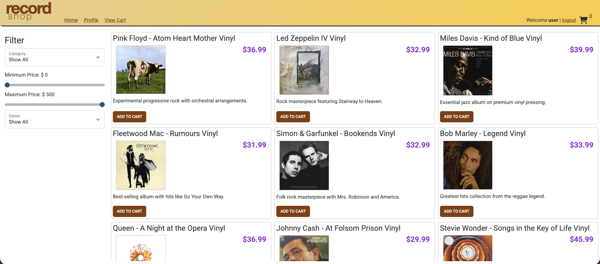
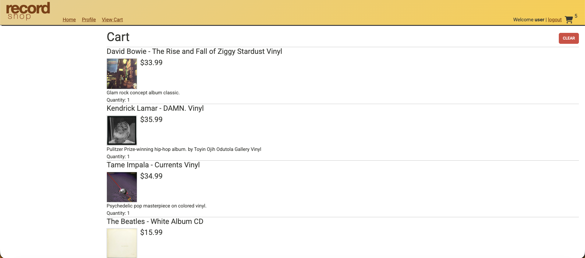
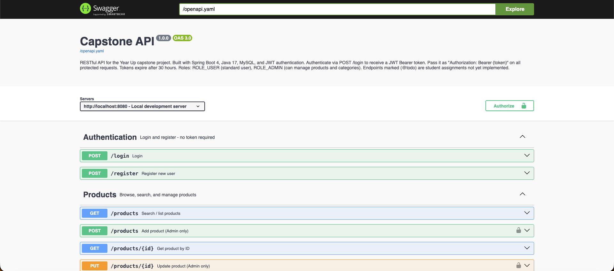

# 🎵 The Record Store

A Spring Boot REST API powering an online record store specializing in vinyl records and music equipment. Built as a backend capstone project, this API handles product browsing, category management, shopping cart functionality, user profiles, and order checkout — all secured with JWT-based authentication.

---

## 📖 About the Project

The Record Store is a backend API built with Java and Spring Boot, backed by a MySQL database. It follows a layered architecture (Controller → Service → Repository) and uses JWT tokens to secure endpoints by role. The frontend is a JavaScript web application that connects to the API at `http://localhost:8080`.

The project involved both implementing new features from scratch and debugging existing functionality — simulating real-world backend development where you inherit a codebase, find and fix bugs, and extend it with new capabilities.

---

## ✅ Features Completed

- User registration and login with JWT authentication
- Browse and search products by category, price range, and subcategory
- Full category management restricted to admin users
- Fixed two bugs in the existing product search and update logic
- Shopping cart — add, update, and clear items per user session
- User profile — view and update personal information
- Checkout — converts a user's cart into a permanent order with line items

---

## 🛠 Tech Stack

| Layer | Technology |
|-------|-----------|
| Language | Java 17 |
| Framework | Spring Boot |
| Database | MySQL |
| ORM | Spring Data JPA / Hibernate |
| Security | Spring Security + JWT |
| Testing | JUnit 5 + Mockito |
| Build Tool | Maven |
| API Testing | Insomnia, Swagger UI |
| IDE | IntelliJ IDEA |

---

## 🚀 Getting Started

### Prerequisites
- Java 17+
- MySQL
- Maven
- IntelliJ IDEA

### Database Setup
1. Open MySQL Workbench
2. Navigate to the `database/` folder in the project
3. Open and execute `create_database_recordshop.sql`
4. This creates the schema and seeds it with sample products, categories, and 3 demo users

**Demo user credentials** (all use password `password`):

| Username | Role  |
|----------|-------|
| user     | USER  |
| admin    | ADMIN |
| george   | USER  |

### Running the API
1. Open the `capstone-api-starter` project in IntelliJ
2. Run the Spring Boot application (`ECommerceApplication.java`)
3. API will be available at `http://localhost:8080`

### Running the Frontend
1. Open the client project folder in a **separate** IntelliJ window (`File → Open`)
2. Open `index.html`
3. Click the browser icon to launch
4. Select **The Record Store** from the store picker
5. Log in with any demo user credentials to access cart and checkout

---

## 📡 API Endpoints

### Authentication
| Method | URL | Description |
|--------|-----|-------------|
| POST | `/register` | Register a new user |
| POST | `/login` | Login and receive JWT token |

### Categories
| Method | URL | Auth | Description |
|--------|-----|------|-------------|
| GET | `/categories` | Public | Get all categories |
| GET | `/categories/{id}` | Public | Get category by id |
| GET | `/categories/{id}/products` | Public | Get all products in a category |
| POST | `/categories` | ADMIN only | Create a new category |
| PUT | `/categories/{id}` | ADMIN only | Update a category |
| DELETE | `/categories/{id}` | ADMIN only | Delete a category |

### Products
| Method | URL | Auth | Description |
|--------|-----|------|-------------|
| GET | `/products` | Public | Search/filter products |
| GET | `/products/{id}` | Public | Get product by id |
| POST | `/products` | ADMIN only | Add a new product |
| PUT | `/products/{id}` | ADMIN only | Update a product |
| DELETE | `/products/{id}` | ADMIN only | Delete a product |

**Search parameters for `GET /products`:**

| Parameter | Type | Description |
|-----------|------|-------------|
| `cat` | int | Filter by category id |
| `minPrice` | double | Minimum price |
| `maxPrice` | double | Maximum price |
| `subCategory` | String | Filter by subcategory |

### Shopping Cart
| Method | URL | Auth | Description |
|--------|-----|------|-------------|
| GET | `/cart` | User | Get current user's cart |
| POST | `/cart/products/{id}` | User | Add product to cart |
| PUT | `/cart/products/{id}` | User | Update product quantity |
| DELETE | `/cart` | User | Clear the cart |

### Profile
| Method | URL | Auth | Description |
|--------|-----|------|-------------|
| GET | `/profile` | User | Get current user's profile |
| PUT | `/profile` | User | Update current user's profile |

### Orders
| Method | URL | Auth | Description |
|--------|-----|------|-------------|
| POST | `/orders` | User | Checkout — convert cart to order |

---

## 🧪 Testing

### Insomnia
Import `capstone-insomnia_collections.yaml` into Insomnia. Run the `0 - Setup (Run First)` folder first to register users and capture authentication tokens, then run each phase folder to test all endpoints.

### Swagger UI
With the API running, open your browser and navigate to:
```
http://localhost:8080/swagger-ui/index.html
```
Click **Authorize** (lock icon, top right), paste your JWT token from `POST /login`, and all subsequent requests will include your token automatically. Note: refreshing the page clears your token — re-authorize after each refresh.

### Unit Tests
Run the full test suite in IntelliJ by right-clicking the `test` folder and choosing **Run All Tests**, or via terminal:
```bash
mvn test
```
Unit tests cover `CategoryService` (all CRUD methods) and `ProductService` (search filter logic and stock update bug fix) using JUnit 5 and Mockito.

---

## 💡 Interesting Piece of Code

### The Product Search Bug Fix

One of the most interesting challenges in this project was debugging a subtle bug in the product search logic. Users reported that `GET /products` with no filters was returning fewer products than actually existed in the database — but there was no obvious error, and the endpoint returned 200 OK every time.

**The bug — before the fix:**

```java
public List<Product> search(Integer categoryId, Double minPrice, Double maxPrice, String subCategory)
{
    List<Product> products = categoryId != null
            ? productRepository.findByCategoryId(categoryId)
            : productRepository.findAll();

    return products.stream()
                   .filter(p -> minPrice == null || p.getPrice() >= minPrice)
                   .filter(p -> maxPrice == null || p.getPrice() <= maxPrice)
                   .filter(p -> subCategory == null || subCategory.equalsIgnoreCase(p.getSubCategory()))
                   .filter(Product::isFeatured)  // ← the bug
                   .toList();
}
```

**Why it's subtle:** the first three filters all follow the same safe pattern — they only apply when the caller actually provided that parameter (`parameter == null || <condition>`). But the last line, `.filter(Product::isFeatured)`, has no parameter behind it at all. It runs unconditionally on every single request, silently discarding any product where `featured = false` in the database — even when the caller never asked to filter by featured status.

**The fix:**

```java
return products.stream()
               .filter(p -> minPrice == null || p.getPrice() >= minPrice)
               .filter(p -> maxPrice == null || p.getPrice() <= maxPrice)
               .filter(p -> subCategory == null || subCategory.equalsIgnoreCase(p.getSubCategory()))
               .toList(); // removed the unconditional isFeatured filter
```

**Why this is interesting:** the bug wasn't a typo or a missing null check — it was a logical error where a filter was applied without any "off switch." It taught me to look beyond whether code *compiles and runs* to whether it *does only what was asked*. The fix was one line, but finding it required understanding the difference between a parameter the caller controls and a property that belongs to the data itself.

---

## 📸 Application Screenshots

| Screenshot | Description |
|------------|-------------|
|  | Record Store homepage — product listing |
|  | Login modal |
|  | Shopping cart with items |
|  | API testing with Insomnia |
|  | Swagger UI endpoint list |

---

## 🗂 Project Structure

```
src/
├── main/
│   └── java/org/yearup/
│       ├── controllers/       # REST controllers — HTTP routing, status codes, security
│       │   ├── AuthenticationController.java
│       │   ├── CategoriesController.java
│       │   ├── ProductsController.java
│       │   ├── ShoppingCartController.java
│       │   ├── ProfileController.java
│       │   └── OrderController.java
│       ├── models/            # JPA entities mapped to database tables
│       ├── repository/        # Spring Data JPA repositories
│       └── service/           # Business logic layer
└── test/
    └── java/org/yearup/
        └── service/           # Unit tests (JUnit 5 + Mockito)
            ├── CategoryServiceTest.java
            └── ProductServiceTest.java

database/
└── create_database_recordshop.sql
```

---

## 🔮 Future Features

Features worth building in a future version, ranked by priority:

1. **Order history** — `GET /orders` to let users view past orders
2. **Product reviews and ratings** — allow users to rate and review products
3. **Wishlist** — save products for later without adding to cart
4. **Inventory management** — decrement stock count on checkout, alert admin when low
5. **Discount codes** — apply promo codes at checkout to reduce order total
6. **Product recommendations** — suggest related products based on category or purchase history
7. **Admin dashboard** — summary view of orders, revenue, and low-stock products

---

## 👤 Author

**Christian Deniz**
GitHub: [@cjdeniz9](https://github.com/cjdeniz9)
Repository: [the-record-store](https://github.com/cjdeniz9/the-record-store)