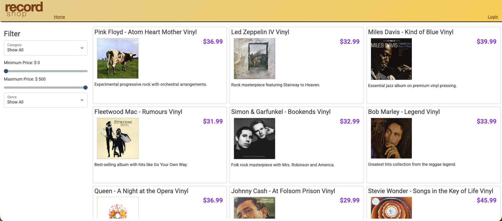
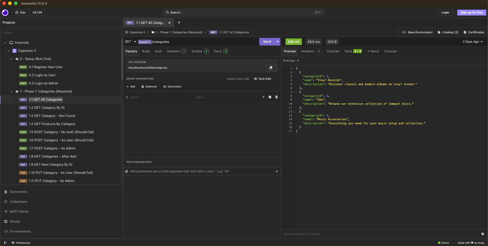

# The Record Store 🎵

A Spring Boot REST API for an online record store specializing in vinyl records and music equipment. Built as a backend capstone project, this API powers a fully functional e-commerce storefront with product browsing, category management, and user authentication.

---

## About the Project

The Record Store is a backend API built with Java and Spring Boot, backed by a MySQL database. It follows a layered architecture (Controller → Service → Repository) and uses JWT-based authentication to secure endpoints. The frontend is a JavaScript web application that interacts with the API at `http://localhost:8080`.

---

## Features

- User registration and login with JWT authentication
- Browse products by category
- Search and filter products by category, price range, and subcategory
- Full category management (admin only)
- Role-based access control (USER and ADMIN roles)

---

## Tech Stack

- **Language:** Java 17
- **Framework:** Spring Boot
- **Database:** MySQL
- **ORM:** Spring Data JPA
- **Security:** Spring Security + JWT
- **Testing:** JUnit 5 + Mockito
- **Tools:** IntelliJ IDEA, Insomnia, MySQL Workbench, Maven

---

## Getting Started

### Prerequisites
- Java 17+
- MySQL
- Maven
- IntelliJ IDEA

### Database Setup
1. Open MySQL Workbench
2. Navigate to the `database/` folder in the project
3. Open and execute `create_database_recordshop.sql`
4. This creates the database and seeds it with sample products and 3 demo users

**Demo user credentials (all use password `password`):**
| Username | Role  |
|----------|-------|
| user     | USER  |
| admin    | ADMIN |
| george   | USER  |

### Running the API
1. Open the `capstone-api-starter` project in IntelliJ
2. Run the Spring Boot application
3. API will be available at `http://localhost:8080`

### Running the Frontend
1. Open the client project folder in a **separate** IntelliJ window (`File > Open`)
2. Open `index.html`
3. Click the browser icon to launch — select **The Record Store** from the store picker

---

## API Endpoints

### Authentication
| Method | URL | Description |
|--------|-----|-------------|
| POST | `/register` | Register a new user |
| POST | `/login` | Login and receive JWT token |

### Categories
| Method | URL | Auth | Description |
|--------|-----|------|-------------|
| GET | `/categories` | Public | Get all categories |
| GET | `/categories/{id}` | Public | Get category by id |
| GET | `/categories/{id}/products` | Public | Get products in a category |
| POST | `/categories` | ADMIN only | Create a new category |
| PUT | `/categories/{id}` | ADMIN only | Update a category |
| DELETE | `/categories/{id}` | ADMIN only | Delete a category |

### Products
| Method | URL | Auth | Description |
|--------|-----|------|-------------|
| GET | `/products` | Public | Search/filter products |
| GET | `/products/{id}` | Public | Get product by id |
| POST | `/products` | ADMIN only | Add a new product |
| PUT | `/products/{id}` | ADMIN only | Update a product |
| DELETE | `/products/{id}` | ADMIN only | Delete a product |

**Search query parameters:**
| Parameter | Type | Description |
|-----------|------|-------------|
| `cat` | int | Filter by category id |
| `minPrice` | double | Minimum price |
| `maxPrice` | double | Maximum price |
| `subCategory` | String | Filter by subcategory |

---

## Testing

### Insomnia
Import `capstone-insomnia_collections.yaml` into Insomnia. Run the `0 - Setup (Run First)` folder first to register users and capture authentication tokens, then run each phase folder to test the endpoints.

### Swagger UI
With the API running, navigate to:
```
http://localhost:8080/swagger-ui/index.html
```
Click **Authorize** (lock icon), paste your JWT token from `/login`, and all subsequent requests will include your token automatically.

### Unit Tests
Run the full test suite via IntelliJ (right-click test folder → Run All Tests) or via terminal:
```bash
mvn test
```

---

## Interesting Piece of Code

<!-- TODO: Add your interesting code snippet here before your demo -->
<!-- Suggestions:
     - The product search/filter bug fix (removing the unconditional isFeatured filter)
     - The CategoriesController implementation with role-based access
     - A unit test that proves a bug existed and is now fixed
-->

```java
// PLACEHOLDER — replace this with your chosen code snippet and explanation
```

**Why this is interesting:**
<!-- Explain what problem this code solves, what you learned writing it,
     or what makes it noteworthy compared to the rest of the project -->

---

## Application Screenshots

<!-- TODO: Add screenshots before your demo day -->
<!-- Suggested screenshots:
     - The Record Store homepage (product listing)
     - Logged-in view / cart
     - Insomnia showing a successful API test
     - Swagger UI endpoint list
-->

| Screenshot | Description |
|------------|-------------|
|  | Record Store homepage |
|  | API testing with Insomnia |

> 💡 Create a `screenshots/` folder in the repo root, add your images there, and the table above will render them automatically on GitHub.

---

## Project Structure

```
src/
├── main/
│   └── java/org/yearup/
│       ├── controllers/     # REST controllers (HTTP layer)
│       ├── models/          # JPA entities / data models
│       ├── repository/      # Spring Data JPA repositories
│       └── service/         # Business logic layer
└── test/
    └── java/org/yearup/
        └── service/         # Unit tests (JUnit 5 + Mockito)
database/
    └── create_database_recordshop.sql
```

---

## Author

**Christian Deniz**
GitHub: [@cjdeniz9](https://github.com/cjdeniz9)
